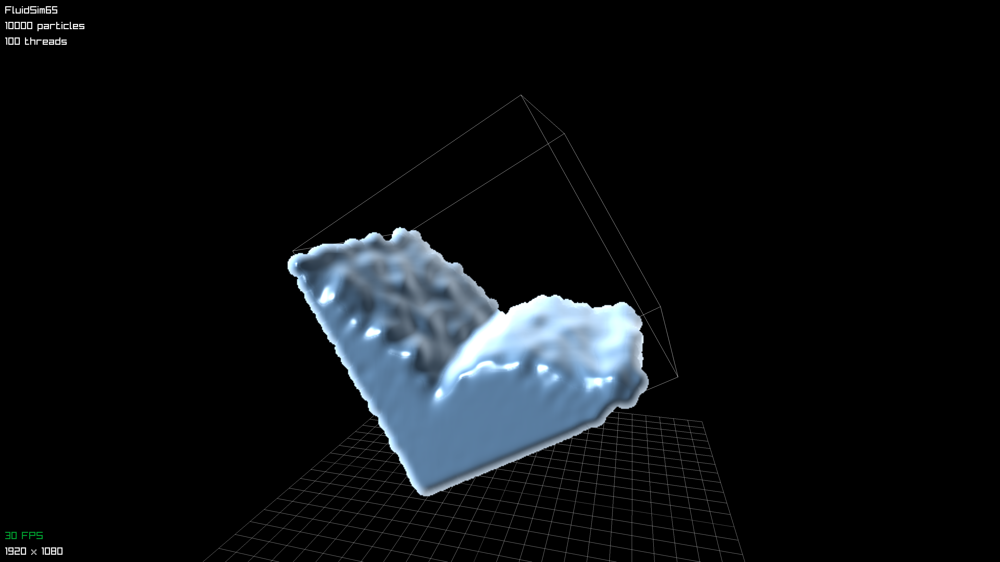

# FluidSim65

Particle based fluid simulation written in C with raylib.
Physics are simulated on cpu with multithreading using smoothed particle hydrodynamics (SPH), and fluid is rendered with screen space rendering.

Inspired by Sebastian Lague's YouTube videos.
[Coding Adventure: Simulating Fluids](https://youtu.be/rSKMYc1CQHE?si=78YYZ68ezc3nw6Wg)
[Coding Adventure: Rendering Fluids](https://youtu.be/kOkfC5fLfgE?si=FPKUDmW7uNMoJlOz)

